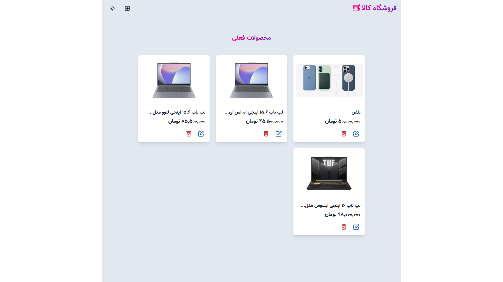

# MERN Product Store Application

A full-stack e-commerce application built with the MERN stack (MongoDB, Express.js, React, Node.js) that allows users to manage products with create, read, update, and delete (CRUD) operations.



[**Live Demo**](https://mern-product-app-xt0a.onrender.com)

## Table of Contents

-   [Project Description](#project-description)
-   [Features](#features)
-   [Technologies Used](#technologies-used)
-   [Prerequisites](#prerequisites)
-   [Installation](#installation)
-   [Environment Variables](#environment-variables)
-   [Usage](#usage)
-   [API Endpoints](#api-endpoints)
-   [Project Structure](#project-structure)
-   [Contributing](#contributing)
-   [License](#license)
-   [Contact](#contact)

## Project Description

This is a full-stack web application that allows users to manage products in an online store. Users can view all products, create new products, update existing products, and delete products. The application features a modern React frontend with a RESTful API backend built with Node.js and Express.

## Features

-   View all products in the store
-   Create new products with name, price, and image
-   Update existing product details
-   Delete products from the store
-   Responsive design for all device sizes
-   Dark/light mode toggle
-   Real-time product management

## Technologies Used

### Backend

-   Node.js
-   Express.js
-   MongoDB with Mongoose
-   dotenv for environment variable management

### Frontend

-   React 18 with TypeScript
-   Chakra UI for component library
-   React Router for navigation
-   Zustand for state management
-   Framer Motion for animations
-   React Icons for icons

## Prerequisites

Before you begin, ensure you have met the following requirements:

-   Node.js (v14 or later)
-   npm or yarn
-   MongoDB (local or cloud instance)
-   Git

## Installation

1. Clone the repository:

    ```bash
    git clone https://github.com/Teezaar/Food-Platform.git
    cd Food-Platform
    ```

2. Install backend dependencies:

    ```bash
    npm install
    ```

3. Install frontend dependencies:

    ```bash
    cd frontend
    npm install
    cd ..
    ```

4. Create a `.env` file in the root directory and add your environment variables (see [Environment Variables](#environment-variables))

5. Build the frontend:
    ```bash
    npm run build
    ```

## Environment Variables

Create a `.env` file in the root directory with the following variables:

```env
MONGO_URI=your_mongodb_connection_string
PORT=5000
NODE_ENV=development
```

Replace `your_mongodb_connection_string` with your actual MongoDB connection string.

## Usage

To run the development server:

```bash
npm run dev
```

To build the project for production:

```bash
npm run build
```

To start the production server:

```bash
npm start
```

The application will be available at `http://localhost:5000`.

## API Endpoints

| Method | Endpoint          | Description          |
| ------ | ----------------- | -------------------- |
| GET    | /api/products     | Get all products     |
| GET    | /api/products/:id | Get a single product |
| POST   | /api/products     | Create a new product |
| PUT    | /api/products/:id | Update a product     |
| DELETE | /api/products/:id | Delete a product     |

## Project Structure

```
mern-product-app/
├── backend/
│   ├── config/
│   │   └── db.js
│   ├── controllers/
│   │   └── product.controller.js
│   ├── models/
│   │   └── product.model.js
│   ├── routes/
│   │   └── product.route.js
│   └── server.js
├── frontend/
│   ├── public/
│   ├── src/
│   │   ├── components/
│   │   ├── pages/
│   │   ├── store/
│   │   └── App.tsx
│   └── vite.config.ts
├── .env
├── package.json
└── README.md
```

## Contributing

Contributions to this project are welcome. Please follow these steps:

1. Fork the repository
2. Create a new branch (`git checkout -b feature/YourFeature`)
3. Commit your changes (`git commit -m 'Add some feature'`)
4. Push to the branch (`git push origin feature/YourFeature`)
5. Open a pull request

## License

This project is licensed under the ISC License. See the [LICENSE](https://github.com/Teezaar/Food-Platform/blob/main/LICENSE) file for details.

## Contact

For support or inquiries, please contact the project maintainers at the [GitHub repository](https://github.com/Teezaar/Food-Platform).
